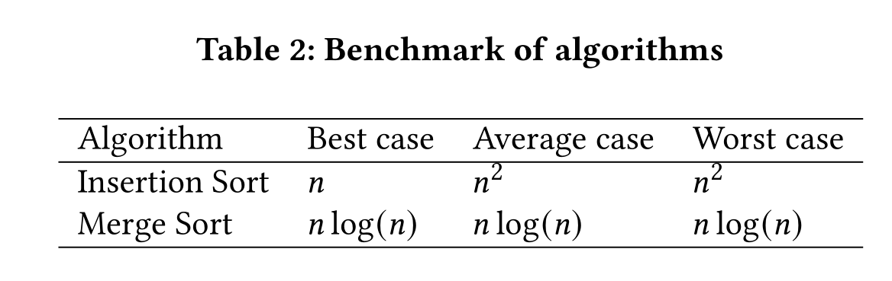
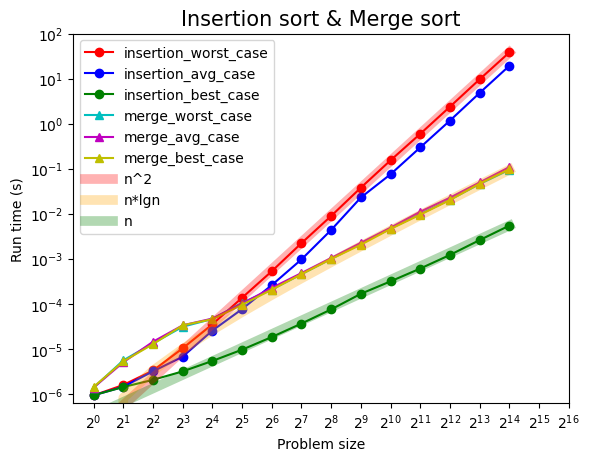

# Benchmarking-Sorting-Algorithms
In this project, we analyse the performance of two well-known sort- ing algorithms, Insertion Sort and Merge Sort. We benchmark the performance of the different algorithms in the worst, average and best case. 

## Thank You!
Please ⭐ this repo if you think this is helpful.

## Abstract
In this project, we analyse the performance of two well-known sort-
ing algorithms, Insertion Sort and Merge Sort. We benchmark the
performance of the different algorithms in the worst, average and
best case. We compare the results from the benchmark to the theo-
retical performance of each algorithm for the three different cases:
the worst, the average, the best.

## Introduction & Methods 
Details in Project_paper.pdf

## Results

## Conclution
We find that the run time of our experiments coincides with the
expected theoretical results regarding both Insertion and Merge
sort.

## Contributing 💡
Thanks to my friend Martin Nesse and Min Jeong Cheon! We did this project together.
